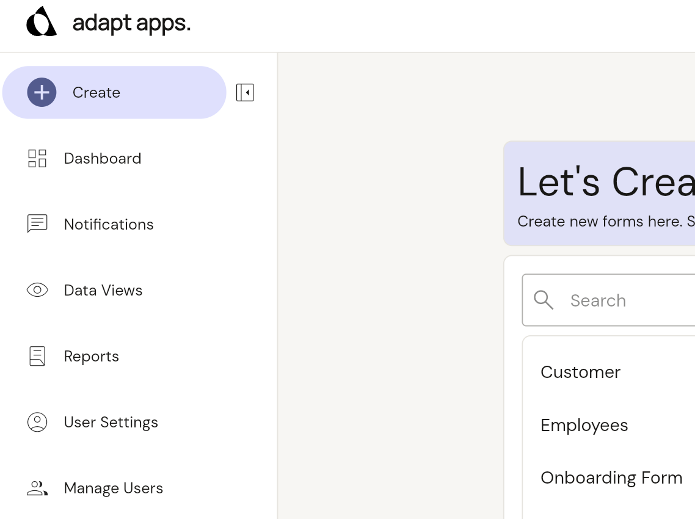

# Import multiple item from excel

1.  Open the create page in the top left hand corner.

2.  click on the more options next to the form and tap on the import from excel.

3.  Either download the template or use an already downloaded. then press next to proceed
        -  include existing data exports all the data from the form.

4. Massage data into excel sheet ensure top 2 columns are present before import.

5. Upload data via the file import and begin import (note: use identifier to update items, it no identifier used items are only created)

5. Please use refresh icon to see progress of import excel

    