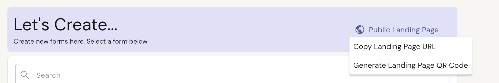
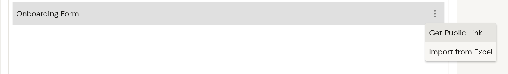

1.  **Navigate to the Create Page:**
    Click on the "Create" button located in the top left-hand corner of the interface.
    

2.  **Choose Public landing page or public form link:**
    Choose the specific type of item you wish to create from the available options.

    **Using the public landing page:**
    Copy the public landing page link and paste in a new tab. to open the resource.
    

4.  **Using a public form link:**
    Select the more icon and tap the share public link.
    

