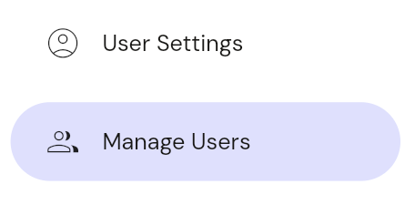
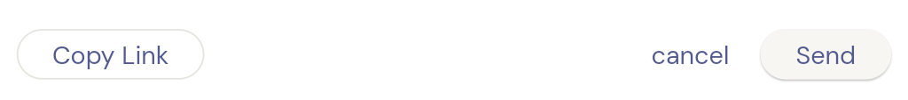
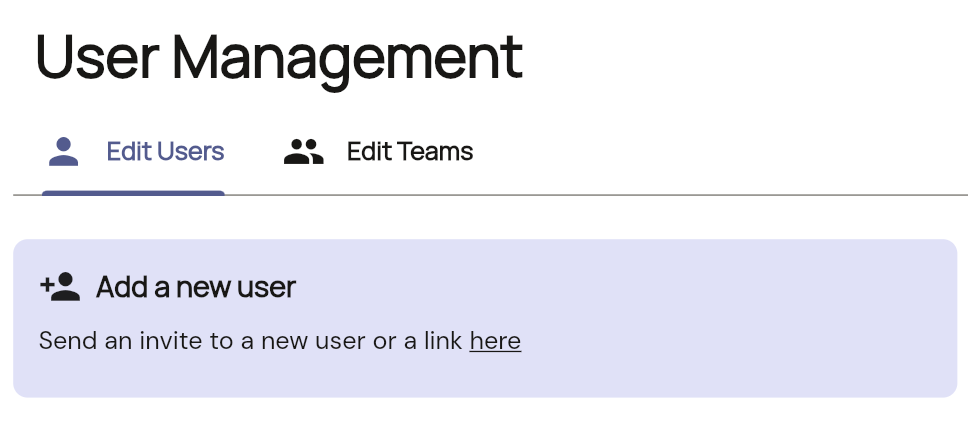

This will send an onboarding link to a new user in which they follow to create a new user in adapt apps.

1.  **Navigate to the user page:**
    Choose user management from the left hand nav.
    

2.  **Tap on the add new user:**
    
    

3.  **Copy onboarding link**
    A popup will appear to send an email link. however click on the copy link to retreive link to send to new user.
    

**Notes**
Emails sending for users is in current development and will available soon